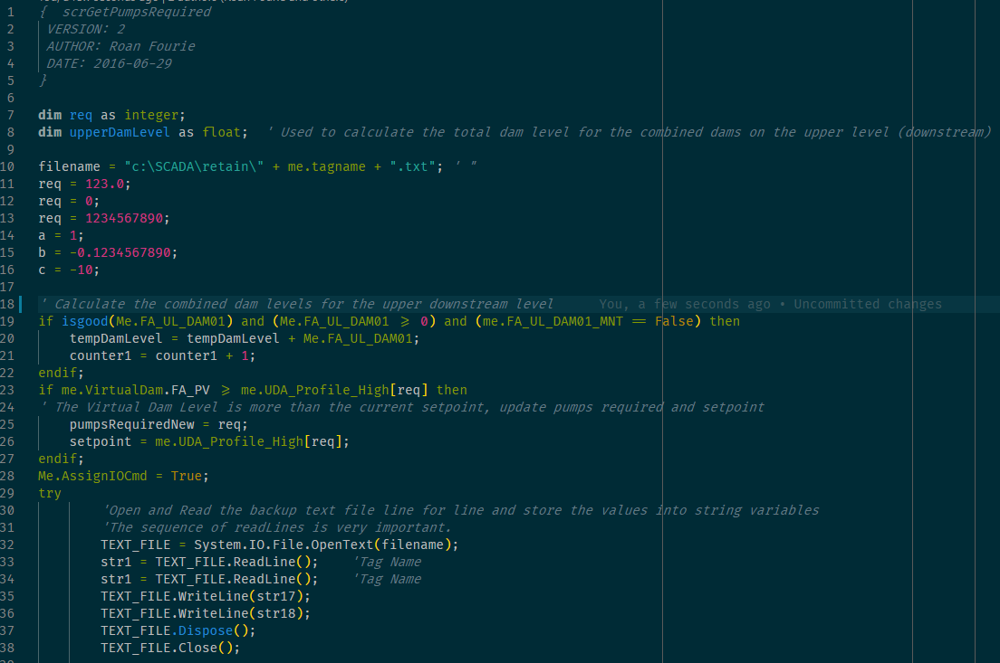

# ArchestrA Lang  
### Archestra Syntax highlighting.  

Archestra Syntax highlighting for QuickScript syntax scripts used within the ArchestrA IDE in System Platform. Write the scripts outside the IDE using Visual Studio Code and this extension then copy and paste it into the archestra script in the IDE.  

## Features  

- **Syntax Highlighting**  

  

## Requirements  

- Have Microsoft Visual Studio Code pre-installed on your Windows computer.  
- Install this extension.  
- Your Archestra quickscript dot NET code files should be normal text files saved with a '*.archestra' file extension.  
- When you open the file you will have syntax highlighting.  
- This extension were developed on a Windows 10 based computer, no compatibility were tested.  

## Known Issues  

No code completion yet.  

## Release Notes  

This project were build and managed using Microsoft's Visual Studio Code editor, for more information see: [Visual Studio Code](https://code.visualstudio.com/)  

### 0.1.0  

Initial release of Archestra-VSCode-Extension.  
Depending on popularity, I may update the extension.  

## Licensing  

Copyright 2019 Roan Fourie  

   Licensed under the Apache License, Version 2.0 (the "License");
   you may not use this file except in compliance with the License.
   You may obtain a copy of the License at

       http://www.apache.org/licenses/LICENSE-2.0

   Unless required by applicable law or agreed to in writing, software
   distributed under the License is distributed on an "AS IS" BASIS,
   WITHOUT WARRANTIES OR CONDITIONS OF ANY KIND, either express or implied.
   See the License for the specific language governing permissions and
   limitations under the License. 

-----------------------------------------------------------------------------------------------------------

